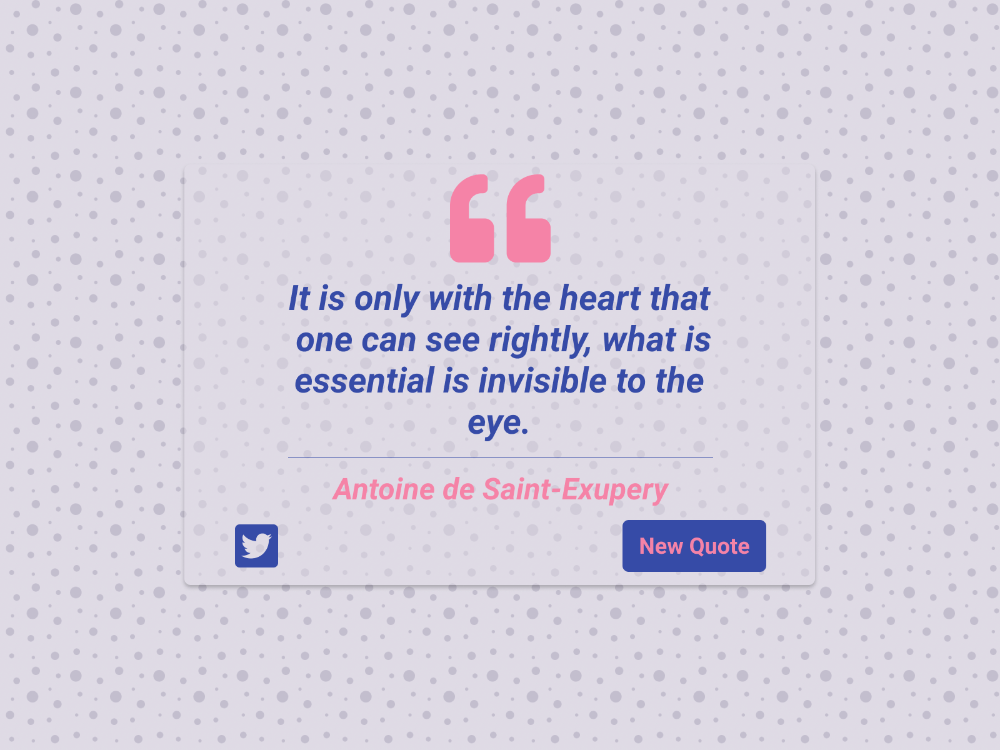

**Challenge Title**
Random Quote Generator

**Challenge Description**
This frontend challenge wil be a fun one. You'll use a Random Quote API to get the quotes.

You can use as many (or as few) tools, libraries, and frameworks as you'd like. If you're trying to learn something new, this might be a great way to push yourself.

**Difficulty Level**
Intermediate

**Tags**
FRONTEND

**Learning**
You'll learn how to fetch API and update data in the UI. So what are you waiting for?

**Requirements**

- A button that fetches a new quote from an external API every time it's clicked.
- Display the quote and its author's name.
- A tweet button to allow users to share the quote on Twitter.
- Show the hover state of all the elements.
- The component should be responsive and display correctly on different screen sizes.
- Make this landing page look as close to the design as possible.

I hope you'll enjoy building this challenge.

Feel free to share your solution on the website or on social media and tag [us](https://twitter.com/codingspace30).
